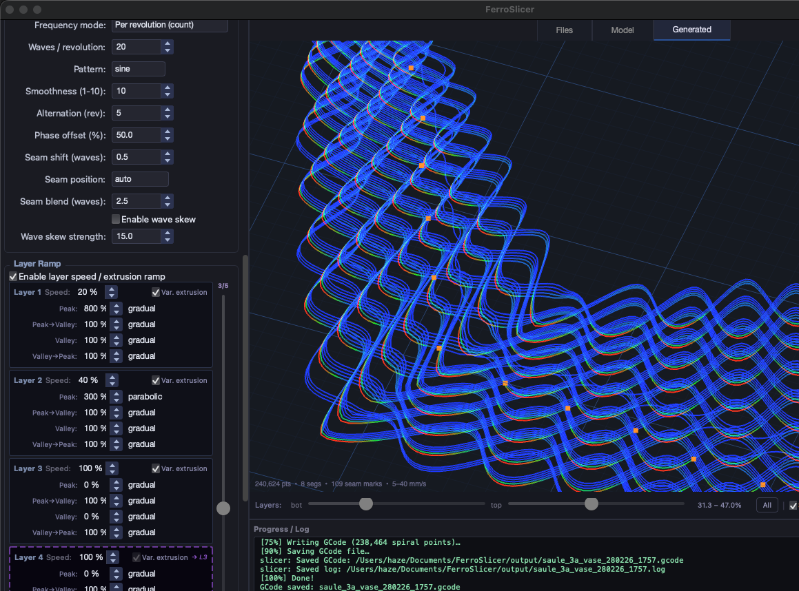

# FerroSlicer

> *A mesh-wave slicer for Klipper 3D printers — sinusoidal surface patterns in sub-second slice times.*

**FerroSlicer** converts STL files into GCode where every layer's extrusion path is displaced in a precise mathematical wave. The result: objects that appear woven, corrugated, or latticed — produced from a single continuous wall with no post-processing.

Built for Klipper. Powered by a Rust extension for sub-second slicing.

---



---

## What it does

Instead of flat, uniform layers, FerroSlicer displaces each extrusion path outward and inward in a sinusoidal (or triangular, sawtooth) wave. Waves from adjacent layers interlock to form a diamond-mesh surface. The result:

- **Mesh lamps** — light passes through wave-gaps between layers
- **Textured vases** — surface appears woven or latticed
- **Spiral prints** — continuous vase-mode path with Z-gradient and full seam control

---

## Features

### Slicing modes
| Mode | Description |
|------|-------------|
| **Spiral vase** | Continuous single-wall spiral, no layer seams, Rust-accelerated |
| **Layer mesh** | Traditional layer-by-layer with alternating wave phases |

### Wave patterns
- **Shapes** — sine, triangular, sawtooth
- **Smoothness** — 1 (sharp) to 10 (very round)
- **Amplitude** — 0–20 mm peak-to-trough displacement
- **Frequency** — fixed wave count per revolution *or* fixed spacing in mm
- **Asymmetry (skew)** — warp wave shape to compensate running-wave distortion
- **Layer alternation** — every N revolutions, wave phase flips to interlock layers into a diamond mesh pattern
- **Phase offset** — controls how far the phase shifts (50 % = classic diamond mesh)
- **Seam blend** — smooth crossfade at the alternation seam (0 = hard step, up to 10 waves)
- **Seam position** — auto, front, back, left, right, front_right, front_left, back_right, back_left, or sharpest corner

### Print settings
- Layer height, print speed, travel speed, fan speed
- First layer speed (%) and first layer squish (%) for adhesion
- Max volumetric speed limit and extrusion multiplier
- Z-hop, print acceleration, travel acceleration
- Spiral resolution (pts/°) for path density

### Base integrity
- **Base height** — solid reinforced zone before mesh waves start
- **Base mode** — fewer gaps, tighter waves, or solid-then-mesh transition
- **Base transition** — exponential, linear, or step ramp into full amplitude

### Layer speed ramp
- Per-layer speed overrides (percentage of base speed)
- Variable extrusion per wave phase — independent peak %, valley %, and ramp types (instant / gradual / slow-start) for peak→valley and valley→peak transitions
- Active layers slider to control how many layers have independent settings

### Skirt / adhesion
- Configurable gap, layers, and loop count
- Prints before the model to prime nozzle and improve bed adhesion

### Test First Layer
- Generates a standalone 30×30 mm filled square for first-layer calibration
- Independent layer height, squish, speed, nozzle and bed temp settings
- Infill-only mode (no perimeter walls)
- Can upload and start directly from the dialog

### Printer profiles
- Multiple named profiles — each stores nozzle/bed/accel/retract settings plus start/end GCode templates
- **Firmware types** — Klipper (G10/G11), Marlin (G1 E), RRF
- **Kinematics** — Cartesian, CoreXY, Delta
- **Origin** — front-left or centre (delta printers)
- Filament diameter (1.75 mm or 2.85 mm)
- Retract distance and speed
- Custom start/end GCode with placeholders: `{bed_temp}`, `{nozzle_temp}`, `{fan_speed}`, `{travel_f}`, `{raise_z}`

### Klipper / Moonraker integration
- Background status polling (non-blocking QThread, 5-second interval)
- Status bar shows: state, progress %, nozzle/bed temps, elapsed time
- **Send to Printer** — upload GCode via Moonraker REST, optional auto-start
- **Heat Up** — send nozzle and bed setpoints without starting a print
- Offline tooltip shows exact error detail and macOS network privacy hints
- `curl` fallback on macOS if Python `requests` is blocked by Local Network privacy

### 3D STL viewer
- Left-drag rotate, right-drag pan, scroll zoom, double-click reset
- Preset views: Iso / Front / Top / Side
- Print volume wireframe and bed grid (updates when printer profile changes)
- Model scale slider (1 %–500 %) — scales GCode output, not just the camera
- Transparent mode for inspecting internal geometry
- Dimensions display (H × W × D × Ø in mm)
- Drag-and-drop STL loading

### 3D toolpath viewer
- OpenGL height-gradient colouring (blue = bed → orange = top)
- Colourless (monochrome) mode
- Z-range slider — clips displayed layers via fragment shader (no geometry rebuild)
- Seam markers — orange dots wherever the phase-alternation seam falls
- Draggable GCode chip — drag to copy file to any folder, double-click to reveal in Finder

### GCode library & print history
- **Library** — list all generated files, live 3D preview, copy CLI command to reproduce, load settings back to panel
- **History** — table of all jobs with status (generated / sent / printing / complete / fail), timestamps, full settings JSON snapshot

### Settings persistence
- Named preset snapshots (save / load / delete)
- Last-used settings restored on startup
- Per-platform data paths: `data/` when running from source, `~/Documents/FerroSlicer/` for the bundled `.app`
| STL Preview | GCode Viewer | Settings | Gcode Explorer |
|---|---|---|---|
|  |  |  |  |

---

## Performance

Tested on a 52,000-triangle / 321-layer vase model:

| Stage | Time |
|-------|------|
| STL parse (Rust) | ~12 ms |
| Geometry analysis (Rust, parallel) | ~48 ms |
| Spiral + wave generation (Rust) | ~78 ms |
| GCode assembly (361 k points) | ~420 ms |
| **Total** | **~0.64 s** |

Pure-Python spiral generation for the same model: ~4 minutes.

---

## Requirements

### Runtime
- Python 3.11+
- macOS 13+ or Linux (Ubuntu 22.04+)
- OpenGL 3.3+ capable GPU (integrated graphics is fine)
- Klipper + Moonraker (optional — needed only for direct upload)

### Python packages
```
PyQt6 >= 6.4
numpy >= 1.24
requests >= 2.28
PyOpenGL >= 3.1
PyOpenGL_accelerate >= 3.1
```

### Build (Rust extension)
- Rust toolchain via `rustup`
- `maturin` (`pip install maturin`)

---

## Installation

### Option A — Run from source

```bash
git clone https://github.com/nebulume/ferroslicer.git
cd ferroslicer

python3 -m venv venv
source venv/bin/activate

pip install -r requirements.txt

# Build the Rust extension (required for vase-mode speed)
./build_rust.sh

python run_gui.py
```

### Option B — macOS `.app` bundle

Download the latest `.dmg` from [Releases](https://github.com/nebulume/ferroslicer/releases), mount it, and drag **FerroSlicer.app** to Applications.

> **macOS note:** On first launch, go to System Settings → Privacy & Security → Local Network and enable FerroSlicer so it can reach the printer.

### Option C — Linux `.AppImage`

```bash
chmod +x FerroSlicer-x86_64.AppImage
./FerroSlicer-x86_64.AppImage
```

---

## Building the Rust extension

The `slicer_core` PyO3 module provides:
- Parallel layer slicing via Rayon
- Vectorised wave computation
- Spiral path generation with lazy point wrapper (avoids 600 k Python object allocations)

```bash
./build_rust.sh

# Or manually:
VIRTUAL_ENV=$PWD/venv \
PATH="$HOME/.cargo/bin:$PATH" \
venv/bin/python -m maturin develop --release -m slicer_core/Cargo.toml
```

The Python slicer falls back to pure-Python generation if the extension is absent — vase mode still works but is significantly slower on large models.

---

## Configuration

**`config.json`** — slicer defaults loaded at startup:

| Key | Default | Description |
|-----|---------|-------------|
| `mesh_settings.wave_amplitude` | `2.0` | Wave peak-to-wall displacement (mm) |
| `mesh_settings.wave_spacing` | `4.0` | Distance between wave peaks (mm) |
| `mesh_settings.wave_pattern` | `"sine"` | Pattern: sine, triangle, sawtooth |
| `mesh_settings.layer_alternation` | `2` | Revolutions before phase flips |
| `mesh_settings.phase_offset` | `50` | Flip offset as % of half-cycle |
| `mesh_settings.base_height` | `28.0` | Solid base height (mm) |
| `mesh_settings.seam_position` | `"auto"` | Seam placement |
| `print_settings.layer_height` | `0.5` | Layer height (mm) |
| `print_settings.print_speed` | `35` | Print speed (mm/s) |
| `print_settings.vase_mode` | `false` | Enable spiral vase mode |
| `printer.nozzle_diameter` | `1.0` | Nozzle diameter (mm) |
| `printer.nozzle_temp` | `260` | Nozzle temperature (°C) |
| `printer.bed_temp` | `65` | Bed temperature (°C) |

**`data/app_settings.json`** — created on first run; stores printer profiles, Moonraker IP/port, and custom GCode. Excluded from version control.

---

## Klipper / Moonraker setup

In **App Settings → Printer Profile**, enter the printer IP and port (default `80` if nginx proxies Moonraker, or `7125` for direct access).

Moonraker endpoints used:

| Method | Endpoint | Purpose |
|--------|----------|---------|
| GET | `/printer/info` | Connection check |
| GET | `/printer/objects/query` | Live state, temps, progress |
| POST | `/server/files/upload` | Upload GCode |
| POST | `/printer/print/start` | Start a print |
| POST | `/printer/gcode/script` | Send temperature commands |

---

## Project structure

```
ferroslicer/
├── project/core/              # Slicer pipeline (Python)
│   ├── stl_parser.py          # ASCII + binary STL reader
│   ├── geometry_analyzer.py   # Layer extraction, perimeter analysis
│   ├── wave_generator.py      # Wave point generation per layer
│   ├── spiral_generator.py    # Vase-mode spiral path
│   └── gcode_generator.py     # GCode assembly, skirt, seam, ramp
├── slicer_core/               # Rust PyO3 extension
│   └── src/lib.rs             # Rayon-parallel slice + spiral
├── gui/
│   ├── main_window.py         # Application shell
│   ├── widgets/
│   │   ├── stl_viewer.py      # OpenGL STL viewer
│   │   ├── toolpath_viewer.py # OpenGL toolpath viewer
│   │   └── settings_panel.py  # All slicing controls
│   ├── dialogs/
│   │   ├── app_settings.py    # Printer profiles, output dir
│   │   ├── test_layer_dialog.py  # First-layer calibration
│   │   ├── gcode_library.py   # Generated file browser
│   │   └── print_history.py   # Job history table
│   └── workers/
│       └── slicer_worker.py   # Background generation thread
├── klipper/
│   └── moonraker.py           # Moonraker REST client
├── db/
│   └── print_db.py            # SQLite job history
├── config.json                # Default slicer settings
├── requirements.txt
├── build_rust.sh
├── run_gui.py                 # GUI entry point
└── test_model.stl             # Bundled test model
```

---

## CLI usage

FerroSlicer exposes a command-line interface for headless / scripted use:

```bash
python -m project path/to/model.stl \
    --wave-amplitude 6 \
    --wave-spacing 4 \
    --layer-alternation 2 \
    --vase-mode \
    --output output/model.gcode
```

Run `python -m project --help` for the full option list.

---

## Output filenames

```
{model}_{amplitude}a_{mode}_{DDMMYY_HHMM}.gcode

Examples:
  vase_2a_mesh_280226_1435.gcode
  lamp_5a_spiral_280226_0912.gcode
  test_first_layer_280226_1501.gcode
```

---

## Building distribution packages

### macOS `.app`

```bash
pip install pyinstaller
pyinstaller FerroSlicer.spec
# Output: dist/FerroSlicer.app
```

Sign and notarise using `packaging/entitlements.plist` for Gatekeeper compatibility.

### Linux `.AppImage`

```bash
pip install pyinstaller
pyinstaller FerroSlicer.spec
# Then use linuxdeploy + AppImage tools
```

---

## License

Copyright © 2025 nebulume

Licensed under the **Apache License 2.0** with the **Commons Clause** restriction.

In plain terms:
- You may use, modify, and distribute this software for any **non-commercial** purpose.
- You may not sell this software or a product primarily derived from it without a separate commercial agreement with the original author.

See [`LICENSE`](LICENSE) for the full legal text. For commercial licensing: open an issue or contact via GitHub.

---

## Contributing

Pull requests are welcome for bug fixes and non-competing features. For significant new features, open an issue first to discuss direction.

---

*FerroSlicer — ferro, from Latin ferrum (iron). Every layer, oxidised into form.*
